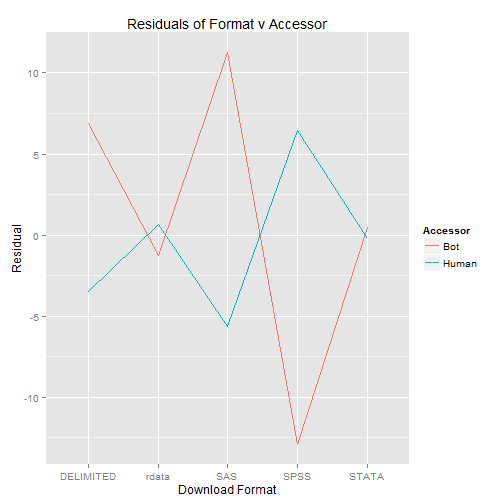
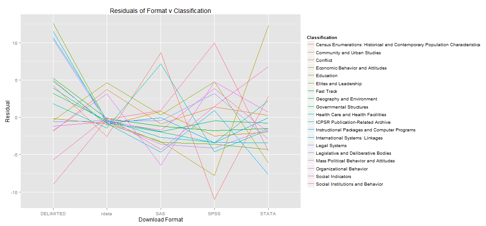

ICPSR Weblog Analysis - Bots in the data
========================================================

Understanding the data: Bots
--------------------------------------------------------

### Bot prominence in the web logs

Bots dominate the homepage hits in the weblog data. In total, nearly 90% of the homepage GET requests are generated from bots. These bots range from ICPSR bots, designed to test and check its own data, to Google bots, malicious bots, etc. Our algorithms could not perfectly identify each bot nor the type of bot. Nonetheless, we found it very interesting that bots so heavily make requests to the ICPSR server.

### Graph 1:
The first graph displays the percent of homepage requests for each ICPSR study homepage that are generated by a human. For the vast majority of studies, this rate is nearly 0%.

 

### Graph 2:
The next graph shows the same data but instead looking at data set downloads rather than homepages. Here, the results are nearly opposite. The vast majority of downloads are done by humans rather than bots.

 

### Graph 3:

Each studied is assigned 1 or 2 topics within a 20-topic classification scheme. We wondered whether certain topics were more popular with humans rather than bots. We can tentatively conclude that topics, such as Instructional Packages and Fast Track, tend to attract more humans than bots. Further analysis might explore if these differences are correlated with the number of studies within each classification or the number of hits within each classification.

 

