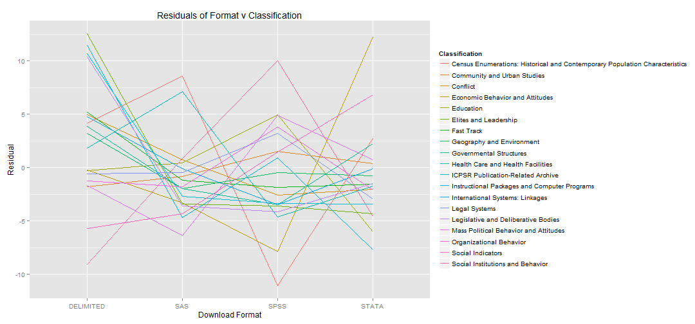
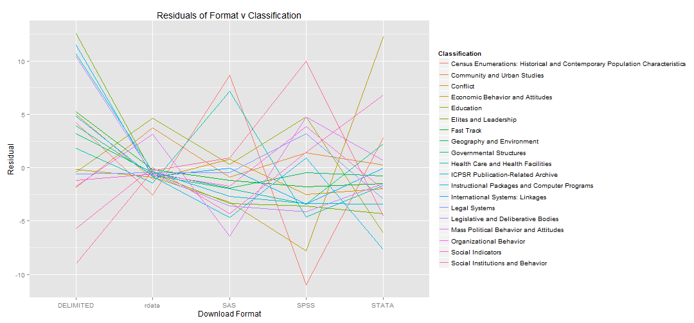

ICPSR Weblog Analysis - How are people using the ICPSR web site?
========================================================

Search Stem Dendrograms
--------------------------------------------------------

### Top 200 Search Stems

This word cloud displays the top 200 search stems with the most common terms weighted by proximity to the center and color. Searches by bots were filtered out for this and subsequent analyses.

* For the code for this map, see: [Wordcloud in searches.R](https://github.com/dvanassc/si618_project/blob/master/R/searches.R)
* For the output of this code (PDF), see: [Search Stem Wordcloud](https://ctools.umich.edu/access/content/group/0929c341-b2de-44aa-a7ca-6224d65e341d/Project%20resources/Web%20Log%20Analysis/wordcloud.pdf)

### Dendrogram of search stems appearing in at least .6% of all searches

This dendrogram displays the relation of the most common search terms. It displays that some terms are very related, such as child abuse and college women. In addition, users have somewhat redundant search habits, searching for terms such as data and ICPSR.

* For the code for this map, see: [Dendro World in searches.R](https://github.com/dvanassc/si618_project/blob/master/R/searches.R)
* For the output of this code (PDF), see: [Dendrogram World](https://ctools.umich.edu/access/content/group/0929c341-b2de-44aa-a7ca-6224d65e341d/Project%20resources/Web%20Log%20Analysis/dendrogramworld.pdf)

### Dendrogram of search stems appearing in at least .9% of all searches in the US

Further analysis of the search data indicated that the US, South Korea, and China are the most freqent searchers on the ICPSR website. This dendrogram of the US data shows that the US mirrors the frequency of searches on a global scale.

* For the code for this map, see: [Dendro US in searches.R](https://github.com/dvanassc/si618_project/blob/master/R/searches.R)
* For the output of this code (PDF), see: [Dendrogram US](https://ctools.umich.edu/access/content/group/0929c341-b2de-44aa-a7ca-6224d65e341d/Project%20resources/Web%20Log%20Analysis/dendrogramus.pdf)

### Dendrogram of search stems appearing in at least .5% of all searches in South Korea

This dendrogram shows how much search trends in South Korea differ from the US. Not only is the content drastically different, focusing on more emotional data, but the appearance of nursing stress is strong enough to account for its appearance on the world chart.

* For the code for this map, see: [Dendro Korea in searches.R](https://github.com/dvanassc/si618_project/blob/master/R/searches.R)
* For the output of this code (PDF), see: [Dendrogram Korea](https://ctools.umich.edu/access/content/group/0929c341-b2de-44aa-a7ca-6224d65e341d/Project%20resources/Web%20Log%20Analysis/dendrogramkorea.pdf)

### Dendrogram of search stems appearing in at least .8% of all searches in China

This dendrogram reveals a third perspective on using ICPSR. Chinese users focus on studies related to China, especially in business and engineering topics.

* For the code for this map, see: [Dendro China in searches.R](https://github.com/dvanassc/si618_project/blob/master/R/searches.R)
* For the output of this code (PDF), see: [Dendrogram China](https://ctools.umich.edu/access/content/group/0929c341-b2de-44aa-a7ca-6224d65e341d/Project%20resources/Web%20Log%20Analysis/dendrogramchina.pdf)

Stat Package Format Histograms
--------------------------------------------------------

### All statistical package formats downloaded overall, color-coded by country:

 

### All statistical package formats downloaded by country with missing country data (NA) removed:

 

### All statistical package formats downloaded by country with NA and 'US' removed:

 

Popular topics visited and downloaded
--------------------------------------------------------

Each study is classified under 1 or 2 topics from a 20-topic classification scheme.  Here, we examine which topics receive the most homepage hits and downloads, generated only by humans (that is, excluding bots). We order the topics in descending order according to the number of studies classified under that topic. Unsurprisingly, the classification with the most studies and the most homepage hits is "Social Instutitions and Behavior." Interestingly, the "Social Indicators" topic has a median number of studies classified under it, yet it also has the second highest number of homepage hits. This result suggests that the relatively few number of studies under this topic are very popular.

 

We created a similar plot as above, examining number of downloads instead of homepage hits. Again, the classifications are ordered in descending order according to the number of studies classified under that topic. The results here are interesting -- by far, the largest number of downloads is from the "Social Institutions and Behavior" category, which is also the category with the most studies classified under it. Also, again, "Social Indicators" sticks out as a topic with a number of downloads consistent with classifications that have a greater number of studies. This result further speaks to the popularity of the individual studies within this classification.

 

