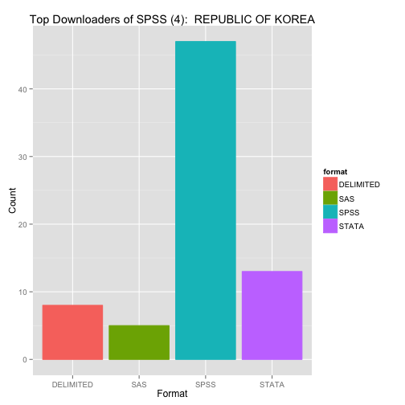
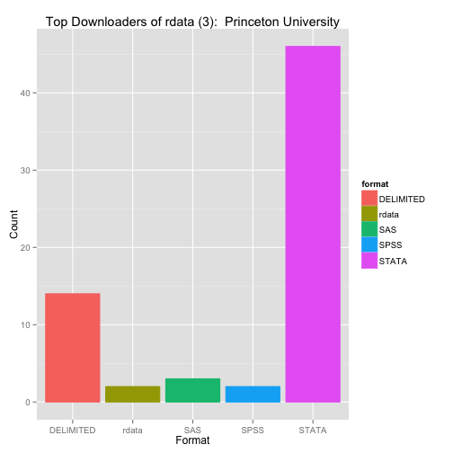
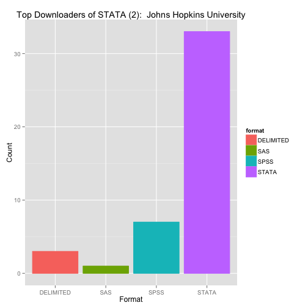
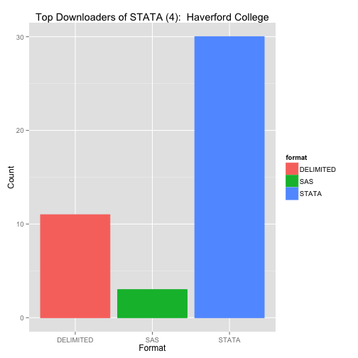

ICPSR Weblog Analysis - Where are people accessing the ICPSR web site from?
========================================================
Maps
--------------------

### Page Requests Worldwide (Bot vs. Human)

This map displays one month's worth of page requests for the ICPSR website. Each dot represents a single row in the table and a single page request. The colors on the map distinguish between human and bot requests. Though the map shows that human requests predominate, the data itself skews in favor of bots - due primarily to the high volume of bot requests generated in Ann Arbor by ICPSR staff. This visualization glosses over this location-specific complexity, but provides a clear overall picture of site accesses.

* For the code for this map, see: [Map #1 in si618_maps.R](https://github.com/dvanassc/si618_project/blob/master/R/si618_maps.R)
* For the output of this code (PDF), see: [Page Requests Worldwide (Bot vs. Human)](https://ctools.umich.edu/access/content/group/0929c341-b2de-44aa-a7ca-6224d65e341d/Project%20resources/Web%20Log%20Analysis/maps_pageviews_world_botvhuman.pdf)

### Downloads Worldwide (Bot vs. Human)

This map, showing downloads for both bots and humans worldwide, provides comparison with the previous map that focused on page views. From this visualization, we can see that the majority of the downloads occurring in this month originated in eastern United States and Western Europe. According to traffic this month, non-US bot downloads happen relatively infrequently.

* For the code for this map, see: [Map #2 in si618_maps.R](https://github.com/dvanassc/si618_project/blob/master/R/si618_maps.R)
* For the output of this code (PDF), see: [Downloads Worldwide (Bot vs. Human)](https://ctools.umich.edu/access/content/group/0929c341-b2de-44aa-a7ca-6224d65e341d/Project%20resources/Web%20Log%20Analysis/maps_downloads_world_botvhuman.pdf)

### Downloads per Classification (Human Only) - World
This world map includes a plot overlay of downloads colored by their primary classification. An interpretation of the graph reveals a fairly even distribution of downloads of different classifications.

* For the code for this map, see: [Map #3 in si618_maps.R](https://github.com/dvanassc/si618_project/blob/master/R/si618_maps.R)
* For the output of this code (PDF), see: [Downloads per Classification (Human Only)](https://ctools.umich.edu/access/content/group/0929c341-b2de-44aa-a7ca-6224d65e341d/Project%20resources/Web%20Log%20Analysis/maps_downloads_classification_humanonly.pdf)

### Downloads per Classification (Human Only) - USA
Due to the high concentration of downloads in the United States, we wanted to zero in on that geographic area. This map shows the geographic origin of downloads, colored according to the classification of the study downloaded. As the worldwide version seemed to indicate, the distribution of color across the points seems to reveal no discernable pattern. Instead, the classification types of the downloads appears varied across the board.

* For the code for this map, see: [Map #4 in si618_maps.R](https://github.com/dvanassc/si618_project/blob/master/R/si618_maps.R)
* For the output of this code (PDF), see: [Downloads per Classification (Human Only) - USA](https://ctools.umich.edu/access/content/group/0929c341-b2de-44aa-a7ca-6224d65e341d/Project%20resources/Web%20Log%20Analysis/maps_downloads_classification_humanonly_usa.pdf)

### Page Requests per Classification (Human Only) - World
This world map includes a plot overlay of page requests colored by their primary classification. An interpretation of the graph reveals a fairly even distribution of page views of different classifications.

* For the code for this map, see: [Map #5 in si618_maps.R](https://github.com/dvanassc/si618_project/blob/master/R/si618_maps.R)
* For the output of this code (PDF), see: [Page Requests per Classification (Human Only, World)](https://ctools.umich.edu/access/content/group/0929c341-b2de-44aa-a7ca-6224d65e341d/Project%20resources/Web%20Log%20Analysis/maps_pageviews_classification_humanonly.pdf)

### Pageviews per Classification (Human Only) - USA
Due to the high concentration of pageviews in the United States, we wanted to zero in on that geographic area. This map shows the geographic origin of pageviews, colored according to the classification of the study viewed. As the worldwide version seemed to indicate, the distribution of color across the points seems to reveal no discernable pattern. Instead, the classification types of the pageviews appears varied across the board.

* For the code for this map, see: [Map #6 in si618_maps.R](https://github.com/dvanassc/si618_project/blob/master/R/si618_maps.R)
* For the output of this code (PDF), see: [Pageviews per Classification (Human Only) - USA](https://ctools.umich.edu/access/content/group/0929c341-b2de-44aa-a7ca-6224d65e341d/Project%20resources/Web%20Log%20Analysis/maps_pageviews_classification_humanonly_usa.pdf)

### Page Request Concentrations - World (Humans Only)
To provide a quick view of page request frequency within individual countries, we created this map that shades countries according to the number of page requests originating within the country. As seen in other graphs, the United States accounts for the vast majority of these requests worldwide, followed distantly by the UK and Canada.

* For the code for this map, see: [Map #7 in si618_maps.R](https://github.com/dvanassc/si618_project/blob/master/R/si618_maps.R)
* For the output of this code (PDF), see: [Page Request Concentrations - World (Humans Only)](https://ctools.umich.edu/access/content/group/0929c341-b2de-44aa-a7ca-6224d65e341d/Project%20resources/Web%20Log%20Analysis/maps_pageviews_humanonly_shading.pdf)

### Download Concentrations - World (Humans Only)
To provide a quick view of download frequency within individual countries, we created this map that shades countries according to the number of downloads originating within the country. As seen in other graphs, the United States accounts for the vast majority of these requests worldwide, followed distantly by the UK and Canada.

* For the code for this map, see: [Map #8 in si618_maps.R](https://github.com/dvanassc/si618_project/blob/master/R/si618_maps.R)
* For the output of this code (PDF), see: [Download Concentrations - World (Humans Only)](https://ctools.umich.edu/access/content/group/0929c341-b2de-44aa-a7ca-6224d65e341d/Project%20resources/Web%20Log%20Analysis/maps_downloads_humanonly_shading.pdf)

### Page Request Concentrations - World (Humans Only, No USA)
By removing the USA counts from the dataset, we obtained a clearer map of distribution among the remaining countries with respect to pageviews. This map shows that the UK, Canada, Chile, Germany, and China all have significant counts - meaning that more requests for ICPSR pages were made from those locations during this month.

* For the code for this map, see: [Map #9 in si618_maps.R](https://github.com/dvanassc/si618_project/blob/master/R/si618_maps.R)
* For the output of this code (PDF), see: [Page Request Concentrations - World (Humans Only, No USA)](https://ctools.umich.edu/access/content/group/0929c341-b2de-44aa-a7ca-6224d65e341d/Project%20resources/Web%20Log%20Analysis/maps_pageviews_humanonly_shading_nousa.pdf)

### Download Concentrations - World (Humans Only, No USA)
By removing the USA counts from the dataset, we obtained a clearer map of distribution among the remaining countries with respect to downloads. This map shows that the UK, Canada, Chile, Germany, and China all have significant counts - meaning that more downloads from the ICPSR site were made from those locations during this month.

* For the code for this map, see: [Map #10 in si618_maps.R](https://github.com/dvanassc/si618_project/blob/master/R/si618_maps.R)
* For the output of this code (PDF), see: [Download Concentrations - World (Humans Only, No USA)](https://ctools.umich.edu/access/content/group/0929c341-b2de-44aa-a7ca-6224d65e341d/Project%20resources/Web%20Log%20Analysis/maps_downloads_humanonly_shading_nousa.pdf)

Stat Package Format Histograms
--------------------------------------------------------

### Top 5 statistical package format downloads by country:

Creates a histogram showing the top 5 countries who downloaded each format, along with a histogram showing the breakdown of download formats for each of these top 5 countries.

                              

### Top 5 statistical package format downloads by institution/university:

Creates a histogram showing the top 5 institutions who downloaded each format, along with a histogram showing the breakdown of download formats for each of these top 5 institutions.

                              

